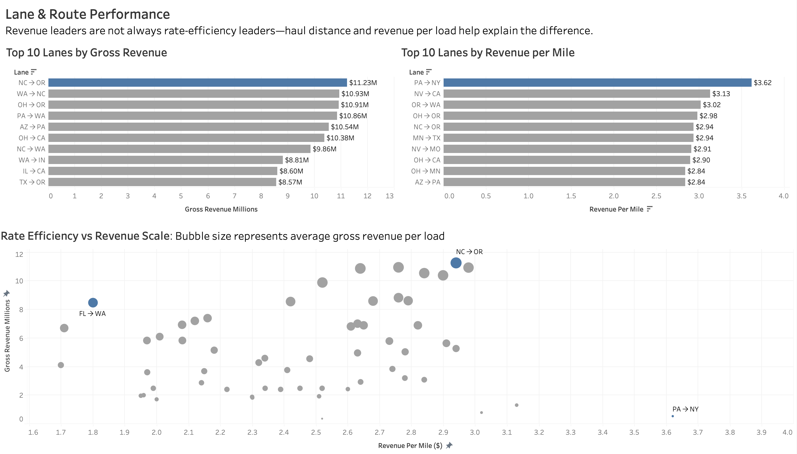
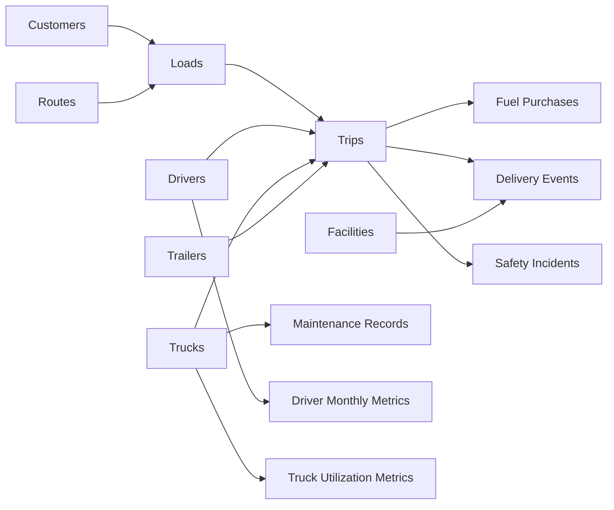

# Logistics Performance Analysis

> An end-to-end logistics analytics case study using MySQL and Tableau Public to evaluate financial performance, customer concentration, lane economics, and delivery reliability.

**Tools:** MySQL · SQL · Tableau Public  
**Analysis period:** 2022–2024  
**Dataset:** Kaggle-derived logistics data  
**Status:** Complete; Tableau Public link to be added after publication

## Table of Contents

- [Executive Summary](#executive-summary)
- [Business Context](#business-context)
- [Business Questions](#business-questions)
- [Headline Results](#headline-results)
- [Key Findings](#key-findings)
- [Recommendations](#recommendations)
- [Dashboard Portfolio](#dashboard-portfolio)
- [Data Architecture](#data-architecture)
- [Dataset Inventory](#dataset-inventory)
- [Analytical Workflow](#analytical-workflow)
- [SQL Analysis](#sql-analysis)
- [Metric Definitions](#metric-definitions)
- [Data Scope](#data-scope)
- [Quality Assurance](#quality-assurance)
- [Limitations](#limitations)
- [Repository Structure](#repository-structure)
- [How to Explore the Project](#how-to-explore-the-project)
- [Future Improvements](#future-improvements)
- [Author](#author)

## Executive Summary

This project evaluates a logistics company across four connected areas: **financial results, customer revenue, lane economics, and delivery reliability**. I used **MySQL** to inspect relationships, validate data grain, clean and transform the source tables, calculate business metrics, and prepare analysis-ready datasets. I then used **Tableau Public** to create four dashboards that translate the analysis into a decision-focused business story.

The company maintained approximately **$99 million in annual gross revenue** from 2022 through 2024. Over the same period, known operating costs declined from **$37.30 million to $32.75 million**, increasing the estimated margin based on available costs from **62.67% to 67.19%**. Contract customers were the largest segment at **$112.33 million**, while First Group was the largest individual customer at **$10.39 million**.

The lane analysis demonstrates why total revenue and rate efficiency must be considered separately. **NC → OR** generated the greatest gross revenue at **$11.23 million**, whereas **PA → NY** produced the highest revenue per mile at **$3.62**. PA → NY was a high-rate, low-scale lane; its shorter haul and lower revenue per load limited its total contribution. Long-haul lanes could generate substantial revenue even at a lower rate per mile.

The most serious operational concern was delivery reliability. Only **44.6% of 85,333 deliveries** were completed on time, resulting in **47,264 late deliveries**. State-level rates ranged from **42.9% to 45.9%**, indicating that the issue was network-wide rather than isolated to one location.

> **Executive conclusion:** Cost control improved the available margin while revenue remained stable, but severe delivery unreliability creates a material risk to customer retention, lane growth, and future revenue quality.

## Business Context

Logistics performance cannot be judged from revenue alone. A lane may produce a high rate per mile but little total revenue because it has few loads or short distances. A customer may generate significant revenue but create concentration risk. Falling known costs may improve an estimated margin, but poor service reliability can threaten future contracts.

This project connects these perspectives rather than treating them as unrelated charts. The analysis progresses from enterprise results to customer mix, lane economics, and operational execution.

## Business Questions

### Financial performance

- How did gross revenue change from 2022 to 2024?
- Did known operating costs increase or decrease?
- Was estimated-margin improvement driven by revenue growth or cost control?

### Customer performance

- Which customers generated the most revenue?
- Which customer model—Contract, Spot, or Dedicated—contributed the most?
- What freight categories supported each customer segment?
- Does the revenue mix indicate concentration risk?

### Lane and route performance

- Which lanes led on gross revenue?
- Which lanes led on revenue per mile?
- Why were the total-revenue and rate-efficiency leaders different?
- How did distance, volume, and average revenue per load explain the difference?

### Delivery reliability

- What proportion of deliveries arrived on time?
- How many deliveries were late?
- Did reliability vary materially by state?
- Was weak performance local or network-wide?

## Headline Results

| Area | Result | Business interpretation |
|---|---:|---|
| 2024 gross revenue | **$99.79M** | Revenue recovered close to its 2022 level after a small 2023 decline |
| Known operating costs | **$37.30M → $32.75M** | Available fuel, maintenance, and claims costs fell $4.55M |
| Estimated margin | **62.67% → 67.19%** | Improvement came mainly from lower known costs, not major revenue growth |
| Largest customer segment | **Contract: $112.33M** | Contract business supplied the largest share of revenue |
| Largest customer | **First Group: $10.39M** | The leading account was important without dominating total revenue |
| Gross-revenue lane leader | **NC → OR: $11.23M** | Strong total revenue scale |
| Revenue-per-mile leader | **PA → NY: $3.62/mile** | Strong unit rate but low total contribution |
| Overall on-time rate | **44.6%** | Fewer than half of deliveries were on time |
| Late deliveries | **47,264** | Reliability was the clearest operational weakness |
| State on-time range | **42.9%–45.9%** | Weak performance was widespread |

## Key Findings

### 1. Revenue was stable rather than growing

| Year | Gross revenue | Direction |
|---:|---:|---|
| 2022 | $99.92M | Baseline |
| 2023 | $98.91M | Slight decline |
| 2024 | $99.79M | Recovery near the 2022 level |

The company showed revenue resilience, but not meaningful top-line growth. Management should distinguish maintaining the existing book of business from creating new growth.

### 2. Available margin improved because known costs fell

| Year | Known operating cost | Estimated margin |
|---:|---:|---:|
| 2022 | $37.30M | 62.67% |
| 2023 | $33.84M | 65.79% |
| 2024 | $32.75M | 67.19% |

The trend is encouraging, but this is an **analytical estimate**, not a full accounting margin. It includes fuel, maintenance, and claims costs available in the dataset but excludes wages, insurance, rent, depreciation, taxes, and overhead.

### 3. Contract customers led a reasonably distributed revenue mix

- **Contract:** $112.33M
- **Spot:** $94.21M
- **Dedicated:** $92.03M

Contract customers contributed the most, but Spot and Dedicated revenue were also substantial. At the individual-account level, First Group led with $10.39M.

### 4. Revenue scale and rate efficiency measured different things

- **Gross revenue** measures a lane's total commercial contribution.
- **Revenue per mile** measures its unit-rate efficiency.

NC → OR ranked first in gross revenue, while PA → NY ranked first in revenue per mile. A high-rate lane may lack volume; a high-revenue lane may depend on longer distances and many loads.

### 5. PA → NY and FL → WA illustrate the lane trade-off

PA → NY generated approximately **$524K** in gross revenue at **$3.62 per mile**. It handled about **1,537 loads**, averaged roughly **94 miles per load**, and produced approximately **$341 per load**. It was efficient per mile but produced limited total revenue because each load covered a short distance and carried relatively low revenue.

FL → WA showed the opposite profile. It generated approximately **$8.45M** at about **$1.80 per mile**, with roughly **1,450 loads**, an average of about **3,230 miles per load**, and approximately **$5,825 per load**. Its lower rate was offset by long-haul distance and greater revenue per shipment.

This is why lane decisions should use total revenue, revenue per mile, load volume, distance, and revenue per load together.

### 6. Delivery reliability was a system-wide problem

Only **44.6%** of **85,333 deliveries** were on time, leaving **47,264 late deliveries**. No served state exceeded 45.9%.

The narrow state range suggests a common process problem, potentially involving dispatching, planning assumptions, appointment scheduling, facility delays, capacity management, or exception escalation. The dashboard identifies the priority; event-level investigation is needed to establish causes.

## Recommendations

| Priority | Recommendation | Evidence | Suggested action |
|---:|---|---|---|
| 1 | Launch a network-wide late-delivery review | Every served state remained below 46% | Segment late deliveries by event, facility, route, customer, day, and delay duration |
| 2 | Target high-volume sources of lateness | 47,264 deliveries were late | Rank states, facilities, customers, and lanes by absolute late count and late rate |
| 3 | Create service-recovery KPIs | Current analysis measures outcomes | Track detection, escalation, rescheduling, and recovery time |
| 4 | Protect high-revenue lanes | NC → OR and other leaders materially support revenue | Monitor service, volume stability, cost-to-serve, and concentration |
| 5 | Test growth on high-rate, low-scale lanes | PA → NY has the strongest rate but limited scale | Assess demand, capacity, customer fit, and profitable minimum volume |
| 6 | Review long-haul economics beyond revenue | Long distance can produce high revenue at a lower rate | Add contribution margin, empty miles, fuel exposure, and driver time |
| 7 | Continue cost control cautiously | Known costs fell $4.55M | Add missing expense categories before making profitability claims |
| 8 | Monitor customer retention and concentration | Contract is the largest segment | Track revenue share, churn risk, service level, and account profitability |

## Dashboard Portfolio

### Dashboard 1 — Logistics Business Performance Overview


**Purpose:** Evaluate annual gross revenue, known operating costs, and estimated margin.

**Main insight:** Revenue remained broadly flat, but lower known costs improved estimated margin by 4.52 percentage points from 2022 to 2024.

**Decision supported:** Determine whether performance improvement came from growth or cost control and identify where a fuller cost model is needed.

### Dashboard 2 — Customer Revenue & Freight Mix Overview


**Purpose:** Explain who generates revenue and which freight categories support each customer segment.

**Main insight:** Contract customers led revenue, but the company was not dependent on that model alone. First Group was the largest individual account.

**Decision supported:** Prioritize account management, assess concentration, and understand the freight mix behind each segment.

### Dashboard 3 — Lane & Route Performance



**Purpose:** Compare revenue scale with rate efficiency and explain why the leaders differ.

**Design:** Ranked bars show the two Top 10 lists. The bubble chart plots revenue per mile against gross revenue, with bubble size representing average gross revenue per load. Only selected outliers are labeled to reduce clutter.

**Main insight:** Lane strategy must balance rate, distance, volume, and revenue per load.

**Decision supported:** Separate lanes that should be protected for total contribution from lanes that may deserve targeted growth for attractive rates.

### Dashboard 4 — Delivery Reliability Overview


**Purpose:** Measure network reliability and determine whether poor service is geographically concentrated.

**Design:** Three KPI cards summarize network performance. A filled map uses a red-to-orange scale because even the highest observed rate remains poor.

**Main insight:** Reliability stayed below 46% in every state with delivery data, indicating a network-wide process issue.

**Important:** Grey states mean **no delivery data / not served**, not 0% performance.

**Decision supported:** Launch a shared operational improvement program while using detailed counts to focus effort.

> **Tableau Public:** The interactive workbook link will be added after publication.

## Data Architecture



Revenue is stored at the load grain, while loads connect to operational child records. Summing load revenue after an uncontrolled one-to-many join can overstate results. The SQL workflow therefore validates cardinality and aggregates costs and events before combining them with revenue.

## Dataset Inventory

The repository contains **14 CSV files with 549,706 records**.

| File | Rows | Grain | Main use |
|---|---:|---|---|
| `customers.csv` | 200 | Customer | Customer ranking and segmentation |
| `loads.csv` | 85,410 | Load | Revenue, customer, route, load type |
| `routes.csv` | 58 | Route | Origin and destination context |
| `trips.csv` | 85,410 | Trip | Actual miles, duration, fuel usage, assets |
| `drivers.csv` | 150 | Driver | Driver attributes |
| `trucks.csv` | 120 | Truck | Vehicle and fleet attributes |
| `trailers.csv` | 180 | Trailer | Trailer attributes and capacity |
| `delivery_events.csv` | 170,820 | Delivery event | Scheduled versus actual performance |
| `fuel_purchases.csv` | 196,442 | Fuel purchase | Fuel cost |
| `maintenance_records.csv` | 2,920 | Maintenance event | Maintenance cost and downtime |
| `safety_incidents.csv` | 170 | Safety incident | Claims and safety analysis |
| `facilities.csv` | 50 | Facility | Delivery-location context |
| `driver_monthly_metrics.csv` | 4,464 | Driver-month | Driver trend analysis |
| `truck_utilization_metrics.csv` | 3,312 | Truck-month | Fleet utilization trends |

Keys and relationships are documented in [DATABASE_SCHEMA.txt](DATABASE_SCHEMA.txt).

## Analytical Workflow

1. **Understand the model:** Reviewed keys, relationships, and source-table grains.
2. **Profile the data:** Checked row counts, date coverage, nulls, and geographic fields.
3. **Validate joins:** Tested whether one-to-many relationships could multiply revenue.
4. **Transform in MySQL:** Calculated revenue, costs, rankings, trends, and efficiency measures.
5. **Prepare analytical outputs:** Created Tableau-ready `vw_...` datasets during development.
6. **Build Tableau views:** Used ranked bars, stacked bars, trend lines, bubbles, KPI cards, and a map.
7. **Standardize presentation:** Used decimal points throughout, such as `$11.23M` and `62.67%`.
8. **Interpret for decisions:** Converted observations into prioritized recommendations and limitations.

## SQL Analysis

The main SQL file is [sql/logistics_analysis.sql](sql/logistics_analysis.sql).

### Techniques demonstrated

- Multi-table joins and relationship checks
- Common table expressions (`WITH`)
- Conditional aggregation with `CASE`
- Null handling with `COALESCE`
- Window functions: `LAG`, `ROW_NUMBER`, and `NTILE`
- Customer and lane ranking
- Year-over-year comparisons
- Cost aggregation at multiple grains
- Revenue concentration and load-value tier analysis
- Customer-type, freight-mix, and destination-market analysis

### Grain-safe analysis

Revenue exists at the load level, but loads can connect to trip or event records. The workflow avoids duplicated revenue by checking relationship counts, aggregating child measures first, joining summarized results at the appropriate business grain, and comparing totals before and after transformation.

### Reproducibility note

The repository includes the core analysis and raw CSV files. Tableau-ready views were created in MySQL, but the current SQL file does not contain every final `CREATE VIEW` statement or an automated import process. Completing those scripts is listed as a future improvement rather than claiming one-command reproducibility.

## Metric Definitions

| Metric | Formula | Meaning |
|---|---|---|
| Gross Revenue | `revenue + fuel_surcharge + accessorial_charges` | Total recorded commercial revenue |
| Known Operating Cost | `fuel_cost + maintenance_cost + claim_amount` | Available costs, not total company expense |
| Estimated Margin $ | `gross_revenue - known_operating_cost` | Revenue remaining after available costs |
| Estimated Margin % | `(gross_revenue - known_operating_cost) / gross_revenue` | Analytical margin based on available costs |
| Revenue per Mile | `gross_revenue / actual_distance_miles` | Revenue earned per actual mile |
| Average Gross Revenue per Load | `gross_revenue / total_loads` | Average revenue generated per shipment |
| On-Time Delivery Rate | `on_time_deliveries / total_deliveries` | Share completed on time |
| Late Deliveries | `total_deliveries - on_time_deliveries` | Deliveries not completed on time |
| Customer Revenue Share | `customer_revenue / total_revenue` | Dependence on an account or segment |

## Data Scope

- The broader Kaggle-derived source was described as covering 2020 through early 2025.
- The supplied `loads.csv` and `trips.csv` extracts cover **January 1, 2022–December 31, 2024**.
- Delivery events extend to **January 3, 2025** and fuel purchases to **January 2, 2025**.
- The partial early-2025 records were excluded from annual comparisons.
- The annual dashboards use **2022–2024**, the complete comparable years in the core extracts.
- 2020 and 2021 were not included in the final annual comparison.

## Quality Assurance

- Compared row counts before and after joins.
- Checked for loads connected to multiple child records before summing revenue.
- Aggregated fuel, maintenance, and claims independently to prevent duplication.
- Used `COALESCE` only when an absent cost component should behave as zero.
- Excluded partial 2025 data from annual trends.
- Used consistent decimal formatting across dashboards.
- Limited scatterplot labels to selected outliers.
- Confirmed that grey map states mean no available delivery data.
- Kept rate metrics and total-value metrics conceptually separate.

## Limitations

1. **Estimated margin is not full profitability.** Several major expense categories are unavailable.
2. **The dataset is Kaggle-derived.** Findings are a portfolio analysis, not audited reporting.
3. **The exact Kaggle URL is not yet documented.** It should be added before final publication.
4. **Partial 2025 data is excluded** because it cannot support a fair annual comparison.
5. **On-time logic follows the supplied field.** The analysis assumes `on_time_flag` correctly implements the business rule.
6. **Grey states are not zero performers.** They represent no data or no service.
7. **Revenue does not equal profit.** High-revenue lanes may also carry high costs.
8. **Revenue per mile does not measure scale.** A high rate can coexist with low total revenue.
9. **The analysis identifies patterns, not causes.** Operational root-cause work is still required.

## Repository Structure

```text
logistics_data/
├── README.md
├── DATABASE_SCHEMA.txt
├── sql/
│   └── logistics_analysis.sql
├── images/
│   ├── business-performance-overview.png
│   ├── customer-revenue-freight-mix.png
│   ├── lane-route-performance.png
│   └── delivery-reliability-overview.png
└── 14 source CSV files
```

## How to Explore the Project

### Review the business story

Start with the Executive Summary, Key Findings, Recommendations, and the four dashboard screenshots.

### Review the analysis

Open [sql/logistics_analysis.sql](sql/logistics_analysis.sql) for the relationship tests, transformations, CTEs, rankings, window functions, cost calculations, and business queries.

### Review the model

Open [DATABASE_SCHEMA.txt](DATABASE_SCHEMA.txt) for table definitions, keys, relationships, and analytical use cases.

### Recreate the project

1. Create a MySQL database.
2. Define the 14 tables using the documented schema.
3. Import the corresponding CSV files.
4. Run `sql/logistics_analysis.sql` section by section.
5. Validate results against the headline figures above.
6. Create or export Tableau-ready views at the correct grain.
7. Connect Tableau Public and rebuild the dashboard views.

The table-creation, import, and complete view-generation steps currently require manual setup.

## Future Improvements

- Add the exact Kaggle source URL and license.
- Publish the workbook and add its Tableau Public link.
- Add complete `CREATE TABLE` and `CREATE VIEW` scripts.
- Add a documented or scripted CSV import process.
- Add automated tests for uniqueness, nulls, foreign keys, and accepted values.
- Extend reliability analysis by facility, route, customer, weekday, and delay band.
- Add a late-delivery Pareto chart.
- Add contribution margin per lane when more cost data becomes available.
- Add empty-mile, detention, utilization, and driver-performance analysis.
- Add a field-level data dictionary.

## Tools

- **MySQL:** cleaning, validation, transformation, aggregation, and analytical outputs
- **SQL:** CTEs, window functions, conditional aggregation, ranking, null handling, and grain-safe joins
- **Tableau Public:** dashboards, calculated fields, sets, conditional labels, maps, tooltips, and KPI cards

## Author

**Andrew Boadi**  
Aspiring Data Analyst / Business Intelligence Analyst

This project demonstrates the ability to move from raw relational data to validated SQL analysis, decision-focused dashboards, and an executive business narrative.
